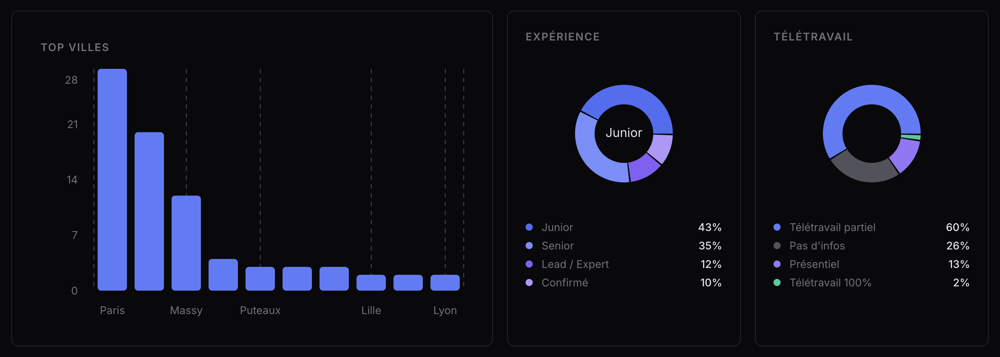
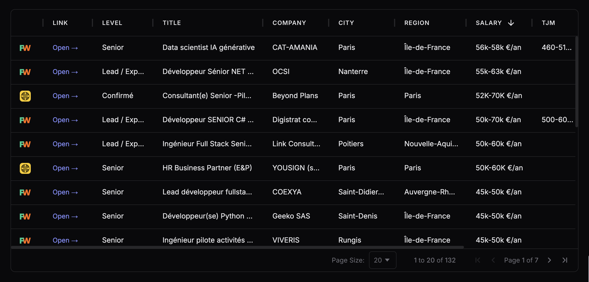

# 🕷️ Aranae

> **Job market intelligence, fully automated.**
> Scrape → normalize → visualize. No manual work.

```
┌─────────────┐     ┌───────────┐     ┌─────┐     ┌───────────┐
│  Scrapers   │ ──▶ │  Raw DB   │ ──▶ │ dbt │ ──▶ │ Dashboard │
│ FW · WTTJ  │     │ Postgres  │     │ ELT │     │   Dash    │
└─────────────┘     └───────────┘     └─────┘     └───────────┘
       ▲                                                 │
       └──────────────── Dagster (daily) ────────────────┘
```




---

## What it does

- **Scrapes** job listings from Free-Work & Welcome to the Jungle
- **Normalizes** salary, TJM, experience, remote policy, location via dbt macros
- **Unifies** all sources into a single `fct_jobs` mart
- **Exposes** a dark-mode analytics dashboard — KPIs, trends, top cities, experience & remote breakdowns

## Stack

`Python 3.13` · `PostgreSQL` · `dbt-core` · `Dagster` · `Dash` · `Pydantic`

---

## Quick start

```bash
# 1. Environment
python -m venv .venv && source .venv/bin/activate
pip install -r requirements.txt

# 2. Start DB
docker compose up -d

# 3. Init tables (first run)
dotenv run -- python scripts/setup_db.py

# 4. Scrape
dotenv run -- python scrapers/freework_scraper.py
dotenv run -- python scrapers/wttj_scraper.py

# 5. Transform
dotenv run -- dbt run --project-dir dbt --profiles-dir dbt

# 6. Dashboard
dotenv run -- streamlit run dashboard.py
```

Or run everything via Dagster:

```bash
dotenv run -- dagster dev
```

---

## Project layout

```
scrapers/      per-source scrapers
services/      ingestor + DB connection
models/        Pydantic schemas
dbt/
  macros/      normalize_date, extract_income, categorize_experience, normalize_city…
  models/
    source/    stg_freework_jobs, stg_wttj_jobs  ← all transforms here
    mart/      fct_jobs                           ← union only
dagster_app/   assets + schedule
dashboard.py   Dash app
```
